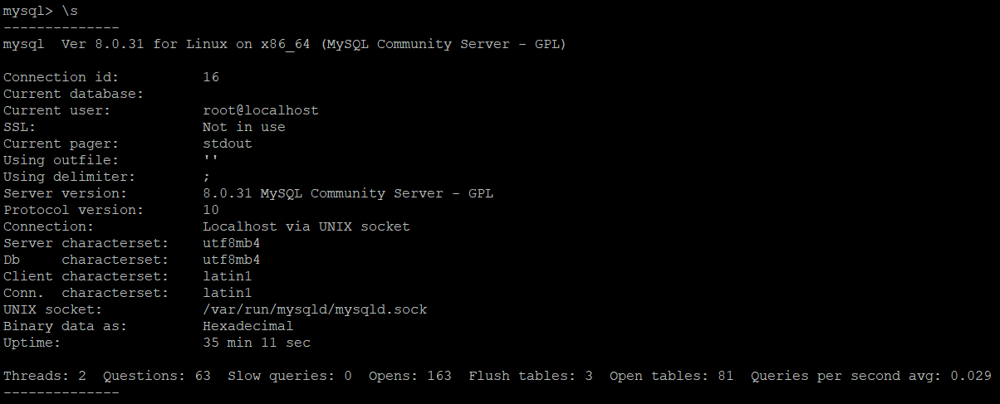
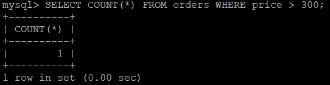

Домашнее задание к занятию "6.3. MySQL"
1. Версия сервера BD: 8.0.31:  
       
   Количество записей с price > 300:  
   
2. Вывод из INFORMATION_SCHEMA.USER_ATTRIBUTES:  
   
3. Таблица orders в базе test_db использует engine "InnoDB":  
     
   Выполнение запросов и вывод SHOW PROFILES:  
   
4. Измененный файл [my.cnf](./files/my.cnf)